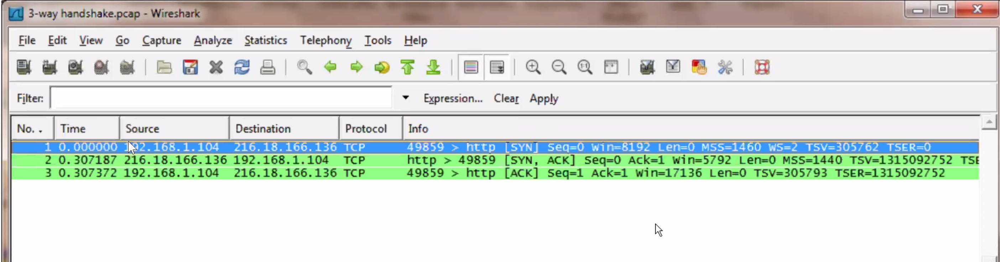

- have it in the VPN connection. before SSH.
- What protocol am i using
- TCP IP header will have source code to destination code
- Very core data that is start to analyze
- Carry wealth of data
- building a header
    - wrap it in the mail
    - all of the information
- Three way handshake for TCP traffic
    - networking
    - pattern in TCP traffic

| step  | client |  server |
|:------:|:----:|:-----:|
| step1 | initiate connection by sending SYN packet | listening and accepting|
| step2 | finding answer with hello from server | SYN and ACK packet sent to client |
| step3 | hello this is ... from client to server| connection established

- Any TCP action you should be able to see it.
- How can you tell if someone is trying to intercept that
    - someone did intercept 
- SYN flood
    - denial of service attack
    - create a bunch of connection attack
- Firewall are smart enough that 
- 3 way handshake in the wire shark

- HTTP methods
    - GET
    - POST
    - PUT
    - DELETE
    - HEAD
    - PATCH
    - OPTIONS
- You can trace the website and see how it works

- 
