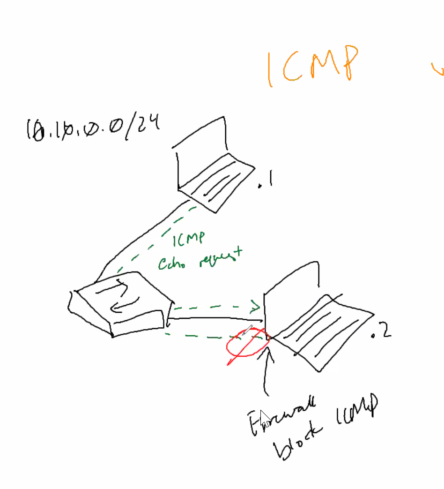

ICMP ping
- echo request to the target destinatinon IP
- ICMP echo request
- firewall block ICMP

ARP: Address resolution protocol
- Totally different behavior
    - switch -> .1
            -> .2
            -> .3
if I know that there is .2 
- ARP is on same subnet
- When you arp you will get table of different devices
- Switch with multiple computer that Arping all of the devices
    - packet storm
    - 
- OPs challenge
    - ARPing the subnet
    - just output psitive

--- 
Cloud Security
- physical security controls - control access
- Some of the settings are in default
- Default and instance security configuration
- shared responsibility
    - business critical instance
- how you access it, VPN, Key pairs.
- NIST - has to be compliant to the regulation
- Database
- Elasticity
- 
