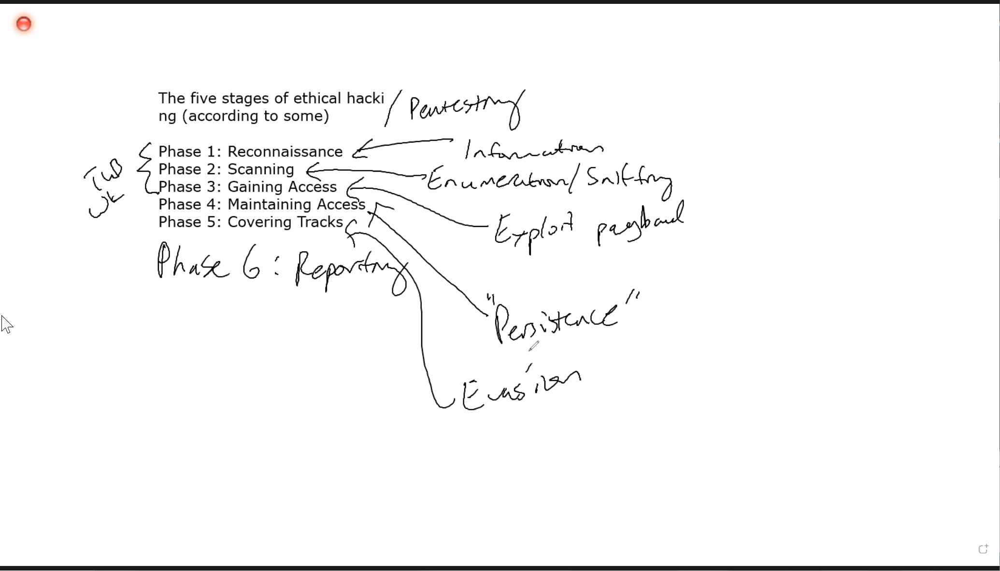

Impacket repo: https://github.com/SecureAuthCorp/impacket

# commando VM

penetration testing & ethical hacking
- compliance
- confidentiality, revenue, goodwill
- Revenue
- Secure configurations
- Security training
- testing new tech

ethical hacker?
- legal exploitation of vulnerabilities for companies with their express permission
- rule of engagement

hacker
- Someone who is circumventing/ exploiting a computer
- white hat
- black hat
- gray hat: the outcome might be favorable for company, but the starting point is not ethical.

Penetration test
    - exploiting and finding vulnerabilities
Security test
    - software, DAST tools
    - patching
Vulnerability test
    - scanning, detecting vuln but NOT exploiting
CTF(capture the flag)
    - Specific objective
    - CTF complete when target system is taken over or flag captured.
DAST vs SAST 
https://www.synopsys.com/blogs/software-security/sast-vs-dast-difference/

The five stages of ethical hacking

hybrid-analysis.com
-get secret key and api key

OSint - open source intelligence
transform - operation that occurs in existing entity
- Company -> domain -> drag arrow - > right click -> email -> email PGP
