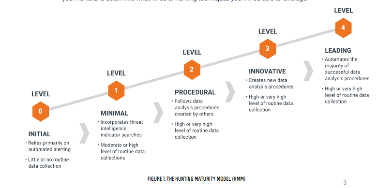
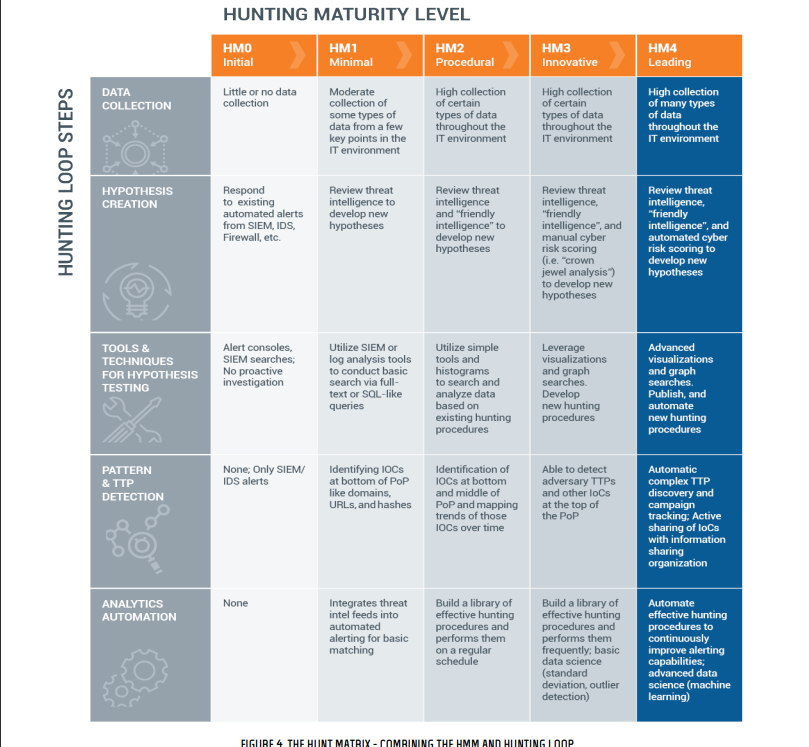

# Threat Hunting with ELK Stack

- What is the ELK stack?
    - It stands for Elasticsearch, Logstash and Kibana.
    - Give you the ability to aggreate logs from all your system and application, analyzes these logs and create visualization for application and infrastructure monitoring. 
    - Elasticsearch
        - Open source RESTful, distributed search and analytics engine built on apache lucene.
        - Schema free JSON documents makes elastic search ideal choice for various log analytic
    - Logstash
        - Opensource data ingestion tool that allow you to gather data from multiple sources, transform it, and send it to your desired destination. 
    - Kibana
        - Opensource data visual and tool for reviewing logs and events. It offers interactive charts and pre-built aggregation and filters.
- ELK stack offer the log analytics space.
- As more and more of your IT infrastructure increase, you need a log management and analytics solution to scale as well.
- Great tool for developers and DevOps to gain valuable insights on failure diagnosis.
- Give you flexibility to select the data ingestion tool that meets your use case requirements

---

## A Framework for Cyber Threat Hunting
- Cyber threat hunting is the next step in the evolution of the modern SOC
- how can you quantify where your org stands on road to effective hunting
- Hunting is a way of proactively and iteratively searching through the network for suspcious activity and isolate that threats.
- Hunting includes SIEM but more of machine assisted technique
- the goal of hunting should be improving automated detection by prototyping.   
  
- Hunting maturity model rates from HM0 to HM4
- HM0
    - org primarily rely on automated alerting tools such as IDS, SIEM or antivirus to detect malicious acts.
- HM1
    - Org relies on third party automated alerting to drive their incident response process however, they are actually doing at least some routine collection of IT data.
    - Some may actually collect a lot of data into one and using those previous information to manage the latest threats.
- HM2 
    - Org are able to learn and apply procedures developed by others on a somewhat regular basis.
    - HM2 organization usually collects a large data
- HM3
    - Org has few hunters who understand a variety of different types of data.
    - Can apply them to identify malicious activity
    - The data collection is comprehensive as it at HM2, if not more advanced.
- HM4
    - any successful hutning process will be operationalized and turned into automation
    - allows them instead to concentrated on improving existing processes.
    - Extremely effect at resisting adversary
- The goal of hunt team should be to get through the loop as quickly as possible.
    1. First step for this is creating a hypothesis
    2. Tools and techniques enabled investigation
        - effective too will leverage both raw and linked data analysis 
    3. Pattern and TTP discovery
    4. Automated analytics

- Hunting Matrix
