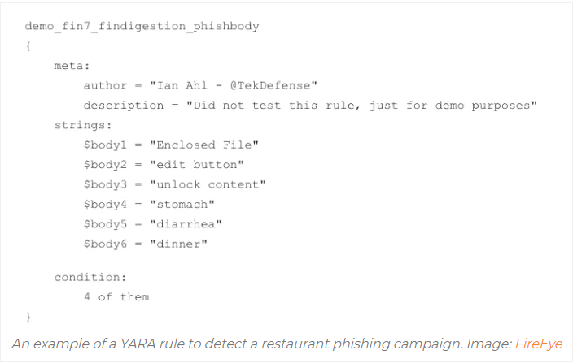

# Malware Detection with YARA Rules

- Yara rule is a Google search to see if the attacker is attacking your computer
- Yara can rack down malware.
- Yara rule is a way to create a rule to prevent any attack from executing.
- Yara rule can apply to email and within network configuration as well.

- Unusual name is a way of sorting out malicious email.
- Yara rule is acronym of Another recursive acronym or yet another ridiculous acronym
- Used in multiple sector of IT security and it is open source so contribution can be made.
- [Github](https://github.com/Yara-Rules/rules)