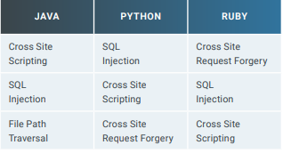

# Scanning the OWASP BWA

- Most common incidents in Q2 2018
    - cross site scripting (XSS)
    - SQL injection (SQLi)
    - Automated Threats
    - File Path Traversal
    - Command Injection (CMDi)

- tCell protects web application at runtimes and acts as first line of defense for these application.
- XSS are the highest incident to the application user
- SQL injection is used to access to an information or run OS commands to gain further access to a system. 
- tCell vs OWASP
- OWASP: open web application security project
- INjection flaws happens when suspicious data is sent to an interpreter as part of a command or query to trick the interpreter into executing unitizing commands.
- Broken authentication occurs when application functions connected to authentication and/or session management are not correctly implemented.
- Attackers are compromising passwords session tokens keys or to exploit other flaws stemming from incorrect implementation.
- The majority of web application attacks are the result of overall scanning for vulnerability
- Attackers are using automated script to attack the web app, which makes the detection a lot more harder
- Appsec efforts to date have ben focused either on creating more secure app or attempting to deploy network appliances to protect in production.
- The containerizaiton and DevOps has been a lot more essential to create an application secure.
- The XSS is one of the most frequent kinds of application layer script
- A malicious script can be embedded into web pages that execute every time the page is loaded.
- Automated threat is software that acting on behalf of a user that identifies a requested file when one server requests it from another.

- Cyrpto mining is on the rise
    - Crypto mining takes a lot of computing power and it can be a sign.
    - End user now need to monitor their system performance to look for website that takes significant resources.
    - Endpoint protection, web filtering tools and content security policies should be enabled.
    